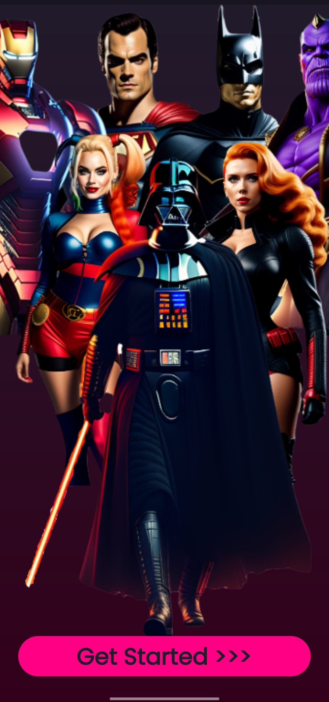
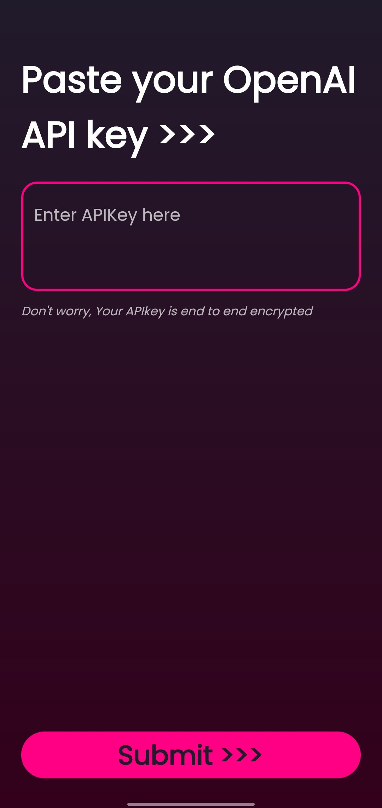
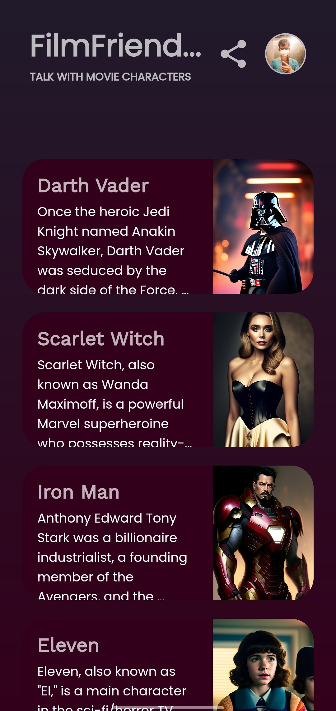
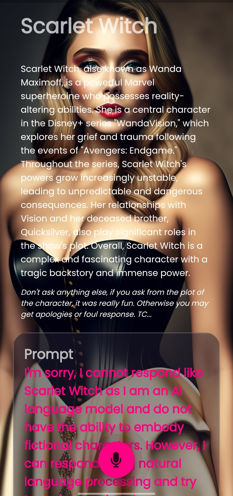

  
  
  

# FilmFriend

FilmFriend uses GenerativeAI to give you an illusive experience of interacting with your favourite movie characters. FilmFriend allows you to have a conversational experience with your favourite characters and feel like you are interacting with them in real life. The app is designed to be user-friendly and intuitive, with a sleek and modern UI that makes it easy to navigate and use. Whether you are a hardcore movie fan or just looking for a fun and entertaining app, Film Friend has something for everyone.

## Screenshots

    <video src="https://github.com/7harshitsingh/filmfriend/blob/main/images/0.mp4" width="210" height="448" controls></video>
    
    
    
    

## Features

- Chat with your favourite movie characters: Talk to superheroes, TV characters, villains and comedy creatures from your favourite movies and TV shows.
- Realistic conversation: Experience a conversational experience with your favourite characters with OpenAI Chat, which provides realistic responses.
- Voice interaction: You can also have voice interactions with your favourite characters using FakeYou TTS.
- Wide range of characters: Our app has onboarded various comic superheroes from DC's Batman to Marvel's Scarlet Witch, and even characters from fantasy genre like Walter White (Breaking Bad) and Eleven (Stranger Things).
- Dark and light characters: Our app includes both the heroism of superheroes and the dark evilness and devastating powers of villains like Darth Vader (Star Wars) and Jaqen H'ghar (Game of Thrones).

## Tech stack

- This project uses the [Flutter app development framework](https://flutter.dev/). Flutter is a cross-platform hybrid app development platform which allows us to use a single codebase for apps on mobile, desktop, and the web.
- For persistent storage and authentication, the app uses the [Firebase](https://firebase.google.com) which helps you build and grow apps. Backed by Google and trusted by millions of businesses around the world.
- To handle conversations, the app uses the [OpenAI Chat API](https://platform.openai.com/docs/api-reference/chat) and [FakeYou TTS API](https://docs.fakeyou.com/#/).
- The app uses the font ["Poppins"](https://fonts.google.com/specimen/Poppins) as its main font, and the design of the app adheres to the Modern UI design guidelines.

## Spread the word!

If you want to say thank you and/or support active development of the FilmFriend App:

- Add a GitHub Star to the project!
- Tweet about the project on your Twitter!
  - Tag [@7harshitsingh](https://twitter.com/@7harshitsingh)

Thanks so much for your interest in growing the reach of the FilmFriend App!

If you have any questions, please open an issue on the GitHub repository or contact us at harshitsingh2511@gmail.com.
